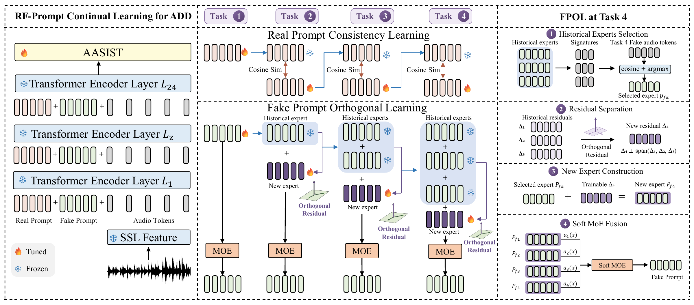

<div align="center">

# RF-Prompt

### Learning as Deepfakes Evolve

**RF-Prompt for Continual Audio Deepfake Detection**

<p>
  
  
  
</p>

<p>s
  
  
  
  
  
</p>

[Overview](#-overview) · [Highlights](#-highlights) · [Results](#-main-results) · [Quick Start](#-quick-start) · [Protocols](#-protocols) · [Reproduction](#-reproduction)

</div>

---

<p align="center">
  
</p>

## 🔎 Overview

Audio deepfake detectors must learn newly emerging generation mechanisms while
retaining previously acquired real- and fake-speech knowledge. This repository
provides:

- **RAMI**, a real-anchored mechanism-incremental protocol that introduces new
  fake mechanisms against a recurring mixed-domain real-speech background.
- **RF-Prompt**, an asymmetric continual-learning method with a shared real
  prompt and an expanding bank of task-specific fake experts.
- **Five controlled protocols** constructed from identical global training,
  development, and evaluation pools.
- **Matched baselines and evaluation**, including task-wise EER, pooled EER,
  and average forgetting.

## ✨ Highlights

| | Design | Purpose |
|---|---|---|
| 🧭 | **RAMI protocol** | Separates real-source arrival from fake-mechanism organization under a fixed sample pool. |
| 🛡️ | **Shared real prompt** | Preserves reusable real-speech knowledge through parameter-level cosine anchoring. |
| 🧩 | **Inherited fake experts** | Transfers a selected historical expert and learns a complementary residual for each new mechanism. |
| 🔀 | **Input-adaptive Soft MoE** | Fuses all complete fake experts into a fixed number of injected tokens without task identity. |
| 🔁 | **Replay-free updates** | Does not store historical training audio or require a feature-teacher forward pass. |

## 🏆 Main results

Final performance on RAMI with XLS-R 300M. All methods use the same task order,
sample pools, training budget, and evaluation procedure. Lower is better.

| Method | Avg EER ↓ | Pooled EER ↓ | AF ↓ |
|---|---:|---:|---:|
| Sequential | 13.130 | 13.445 | 6.433 |
| EWC | 12.255 | 12.805 | 5.827 |
| SinglePrompt | 11.665 | 12.105 | 5.593 |
| **RF-Prompt** | **10.110** | **10.370** | **4.560** |

> Values are percentages. Every task checkpoint is selected using development EER.

## 🚀 Quick Start

### 1. Create the environment

```bash
conda create -n rfprompt python=3.10 -y
conda activate rfprompt
pip install -r requirements.txt
pip install pytest
```

### 2. Download the SSL backbone

```bash
huggingface-cli download facebook/wav2vec2-xls-r-300m \
  --local-dir /path/to/wav2vec2-xls-r-300m
```

### 3. Run RF-Prompt on RAMI

```bash
bash scripts/run_rami.sh \
  /path/to/wav2vec2-xls-r-300m \
  /path/to/protocol_5_rami \
  /path/to/output
```

<details>
<summary><b>Primary configuration</b></summary>

- five shared real-prompt tokens per transformer layer;
- five adaptively fused fake-prompt tokens per transformer layer;
- 50 epochs per task and seed 2026;
- real-prompt cosine weight `1.0` over all 24 layers;
- fake-residual orthogonality weight `0.1` over all 24 layers;
- frozen XLS-R backbone with a trainable AASIST backend;
- best-development checkpoint propagation between tasks.

</details>

## 🗂️ Data manifests

Audio is not redistributed. Obtain ASVspoof 2019 LA, ASVspoof 5, CodecFake,
and AT-ADD from their official sources. Each task split is represented by a CSV:

```csv
utt_id,audio_path,label
example_real,/path/to/example_real.wav,0
example_fake,/path/to/example_fake.wav,1
```

`audio_path` may be absolute or relative to its CSV. RAMI uses:

```text
protocol_5_rami/
├── b0_classical_waveform/{train,dev,eval}.csv
├── b1_neural_vocoder/{train,dev,eval}.csv
├── b2_neural_codec/{train,dev,eval}.csv
└── b3_codec_token_alm/{train,dev,eval}.csv
```

## 🧭 Protocols

All protocols contain the same global samples; only task assignment changes.

| Protocol | real arrival | fake organization |
|---|---|---|
| 1 | Dataset-wise | Dataset-wise |
| 2 | Dataset-wise | Mechanism-wise |
| 3 | Source-support-matched | Mechanism-wise |
| 4 | Four-domain mixture | Dataset-wise |
| **5 (RAMI)** | **Four-domain mixture** | **Mechanism-wise** |

Build all five protocols from a locked source pool:

```bash
python scripts/build_five_protocols.py \
  --source /path/to/locked_source \
  --output /path/to/five_protocols
```

The builder writes sample counts, hashes, and pool-equality checks to
`audit.json`. See [docs/PROTOCOLS.md](docs/PROTOCOLS.md) for the expected source
layout and taxonomy.

## ♻️ Reproduction

### Matched continual-learning baselines

The training entry point exposes the following matched baselines. Citations
identify the original methods; every score in the paper is produced by our
audio/RAMI implementation under the matched training setup.

| CLI name | Original method | Where it is used in this project |
|---|---|---|
| `sequential` | Naive sequential fine-tuning | Main RAMI comparison, retention trajectories, limited-fake-data study, and cross-backbone study. |
| `ewc` | [Elastic Weight Consolidation (EWC)](https://doi.org/10.1073/pnas.1611835114) | Main RAMI comparison, retention trajectories, and limited-fake-data study. |
| `lwf` | [Learning without Forgetting (LwF)](https://doi.org/10.1007/978-3-319-46493-0_37) | Additional matched distillation reference documented in the appendix and released for reproduction; not a main-table result. |
| `owm` | [Orthogonal Weight Modification (OWM)](https://doi.org/10.1038/s42256-019-0080-x) | Main RAMI comparison and retention trajectories. |
| `rawm` | [RAWM](https://proceedings.mlr.press/v202/zhang23au.html) | ADD-specific baseline in the main RAMI comparison and retention trajectories. |
| `rwm` | [Radian Weight Modification (RWM)](https://ojs.aaai.org/index.php/AAAI/article/view/29929) | ADD-specific baseline in the main RAMI comparison, retention trajectories, and limited-fake-data study. |
| `rego` | [Region-Based Optimization (RegO)](https://ojs.aaai.org/index.php/AAAI/article/view/34535) | ADD-specific baseline in the main RAMI comparison, retention trajectories, and limited-fake-data study. |

Use the matched 50-epoch, batch-32 schedule:

```bash
bash scripts/run_baseline_rami.sh ewc \
  /path/to/wav2vec2-xls-r-300m \
  /path/to/protocol_5_rami \
  /path/to/output
```

The entry-point defaults match the primary paper configuration: RAMI layout,
50 epochs, batch size 32, development evaluation every epoch, response-based
fusion, inherited fake experts, real-prompt cosine weight 1.0, and residual
orthogonality weight 0.1.

### Adapted prompt baselines

The following methods were originally proposed for different continual-learning
or adaptation settings. We adapt them to the same frozen speech backbone,
binary ADD objective, RAMI task stream, and training budget.

| CLI name | Original method | Where it is used in this project |
|---|---|---|
| `oisoprompt` | [Oiso et al. prompt tuning](https://doi.org/10.21437/Interspeech.2024-81) | Audio-domain-adaptation reference in the main RAMI comparison and retention trajectories. |
| `singleprompt` | [SinglePrompt](https://openaccess.thecvf.com/content/CVPR2026F/html/Park_Is_Prompt_Selection_Necessary_for_Task-Free_Online_Continual_Learning_CVPRF_2026_paper.html) | Prompt-based CL baseline in the main RAMI comparison and retention trajectories. |
| `kaprompt` | [KA-Prompt](https://proceedings.mlr.press/v267/xu25as.html) | Prompt-based CL baseline in the main RAMI comparison and retention trajectories. |
| `smope` | [SMoPE](https://proceedings.iclr.cc/paper_files/paper/2026/hash/099ba28b20462dac7bf057d21c27a011-Abstract-Conference.html) | Prompt-based CL baseline in the main RAMI comparison and retention trajectories. |
| `rainbow` | [RainbowPrompt](https://openaccess.thecvf.com/content/ICCV2025/html/Hong_RainbowPrompt_Diversity-Enhanced_Prompt-Evolving_for_Continual_Learning_ICCV_2025_paper.html) | Additional development implementation; released for inspection but not reported as a main-table result. |

Complete BibTeX entries for all cited baselines are provided in
[`CITATIONS.bib`](CITATIONS.bib). Implementation-specific adaptation details
are documented separately so that these results are not confused with scores
reported by the original papers.

```bash
bash scripts/run_prompt_baseline_rami.sh singleprompt \
  /path/to/wav2vec2-xls-r-300m \
  /path/to/protocol_5_rami \
  /path/to/output
```

Supported names are `oisoprompt`, `singleprompt`, `kaprompt`, `smope`, and
`rainbow`. See [adaptation details](docs/ADAPTED_PROMPT_BASELINES.md).

### Common-group protocol comparison

Every evaluation writes utterance-level scores. Regroup the final scores from
any protocol into the four RAMI groups used for the paper's common average:

```bash
python scripts/evaluate_common_groups.py \
  --scores /path/to/output/eval_scores_after_B3.csv \
  --rami_root /path/to/protocol_5_rami \
  --output /path/to/output/common_rami_metrics.json
```

The script reuses the same scores and verifies that RAMI exactly partitions the
evaluated pool.

### Alternative SSL backbones

RF-Prompt and Sequential support XLS-R 300M/1B/2B, WavLM-Large, and W2V-BERT
2.0. See [cross-backbone commands](docs/CROSS_BACKBONES.md).

### Outputs

```text
output/
├── best_dev_B0.pt ... best_dev_B3.pt
├── results.json
├── summary.json
├── eval_scores_after_B0.csv ... eval_scores_after_B3.csv
└── pooled_eval.csv
```

`summary.json` contains the final average EER, pooled EER, and average
forgetting. `results.json` retains the complete acquired-task trajectory.

### Tests

```bash
pytest -q tests
```

The release includes regression tests for expert growth, inheritance,
residual orthogonality, fixed-length soft fusion, real-prompt protection, and
routing behavior.

See [release cleanup notes](docs/CODE_CLEANUP.md) for removed experimental
switches, checkpoint compatibility and the scope of equivalence checks.

## 🧱 Code structure

```text
continual/orthogonal_prompt.py  # RF-Prompt encoder and expert bank
continual/trainer.py            # continual optimization and evaluation
CITATIONS.bib                   # source papers for released baselines
scripts/train_rfprompt.py       # RF-Prompt and matched baseline CLI
scripts/run_rami.sh             # exact primary configuration
scripts/run_baseline_rami.sh    # matched general-CL baselines
scripts/run_prompt_baseline_rami.sh # adapted prompt baselines
scripts/run_backbone_rami.sh    # matched cross-backbone runs
scripts/evaluate_common_groups.py # Table-2 common grouping
scripts/build_five_protocols.py # controlled protocol construction
dataset.py                      # portable manifest loader
tests/test_rfprompt.py          # regression tests
```

## 📄 Citation

If you use any code, protocol definition, or implementation from this
repository, please cite our paper:

```bibtex
@article{xie2026rfprompt,
  title   = {Learning as Deepfakes Evolve: RF-Prompt for Continual Audio
             Deepfake Detection},
  author  = {Xie, Yuankun and others},
  journal = {arXiv preprint},
  year    = {2026}
}
```

If you use a baseline implementation released in this repository, please also
cite the corresponding original work:

- General continual learning: EWC, LwF, and OWM.
- Continual audio deepfake detection: RAWM, RWM, and RegO.
- Prompt learning or audio adaptation: Oiso Prompt, SinglePrompt, KA-Prompt,
  SMoPE, and RainbowPrompt.

Copy-ready BibTeX entries for all of these methods are provided in
[`CITATIONS.bib`](CITATIONS.bib). The tables in the
[reproduction section](#️-reproduction) state where each implementation is
used in our experiments. The RF-Prompt entry above is provisional and should be
updated with the complete author list and arXiv identifier when available.

## 📜 License

Released under the [MIT License](LICENSE). Restricted datasets remain subject
to their original licenses and are not included in this repository.
